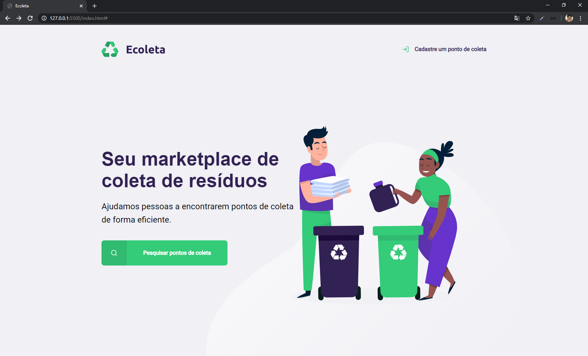

<h1 align="center">
    
</h1>

<h1>
<<<<<<< HEAD
    
    
=======
    
>>>>>>> 6f96fa0c9cdd7f1b63b189c2de5082c362e2bfb1
</h1>

<h3 align="center">
    <a href="https://nextlevelweek.com/inscricao/1?gclid=EAIaIQobChMIotuFiO_g6QIVBwiRCh0kcAbAEAAYASAAEgLgWPD_BwE">Next Week Level</a>
<h3 >

# Indice

- [Sobre](#-sobre)
- [Tecnologias Utilizadas](#-tecnologias-utilizadas)
- [Como baixar o projeto](#-como-baixar-o-projeto)

## 🔖 Sobre

<<<<<<< HEAD
O projeto **Ecoleta** é um site que foi criado na semana **Next Week Level** com o intuito de introdução ao desenvolvimento web.
=======
O projeto **Ecoleta** é um site que ajuda pessoas a encontrarem pontos de coleta de lixo. Site que foi criado na semana **Next Week Level** com o intuito de introdução ao desenvolvimento web.
>>>>>>> 6f96fa0c9cdd7f1b63b189c2de5082c362e2bfb1

---

## 🚀 Tecnologias utilizadas

O projeto foi desenvolvido utilizando as seguintes tecnologias

- [CSS](https://developer.mozilla.org/pt-BR/docs/Web/CSS)
- [HTML](https://developer.mozilla.org/pt-BR/docs/Web/HTML)
- [JavaScript](https://developer.mozilla.org/pt-BR/docs/Aprender/JavaScript)

---

## 🗂 Como baixar o projeto

```bash

    # Clonar o repositório
    $ git clone https://github.com/grioos/ecoleta

    # Entrar no diretório
    $ cd ecoleta

    # Iniciar o projeto
    $ abrir no navegador o arquivo index.html
```

---

Desenvolvido por [Gabriel Rios](https://www.linkedin.com/in/grioos/)
